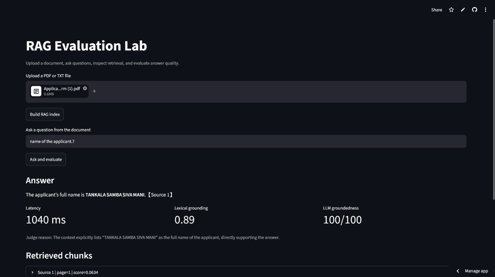

# RAG Evaluation Lab

A production-style RAG evaluation project that lets users upload documents, ask grounded questions, inspect retrieved context, and measure answer quality.

## Live Demo

[Open the deployed app](https://rag-evaluation-lab-samba.streamlit.app/)

## Demo



## What this project does

This application allows users to:

- Upload PDF or TXT documents
- Build a retrieval index
- Ask questions from uploaded documents
- Inspect top retrieved chunks
- Generate grounded answers using Groq
- Measure response latency
- Measure lexical grounding
- Evaluate answer groundedness using an LLM judge

## Example Workflow

```text
Upload PDF/TXT
      ↓
Chunk document
      ↓
Build retrieval index
      ↓
Ask question
      ↓
Retrieve top-k chunks
      ↓
Generate grounded answer
      ↓
Evaluate answer quality